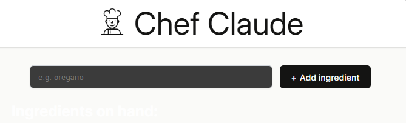
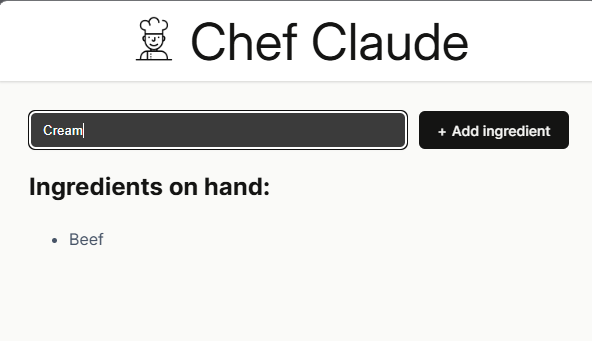
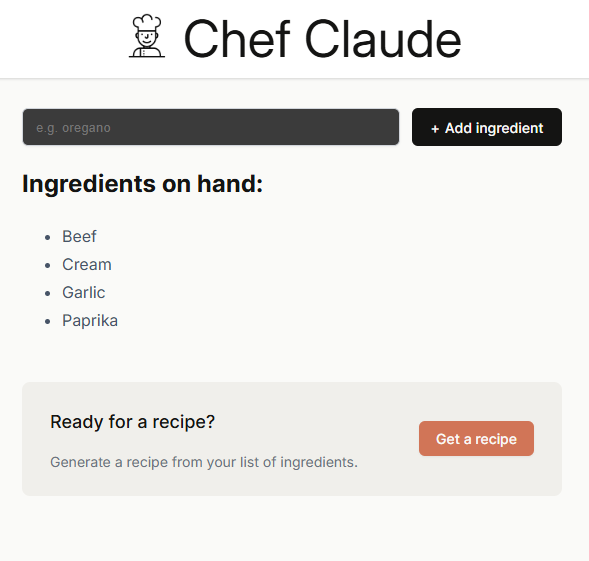
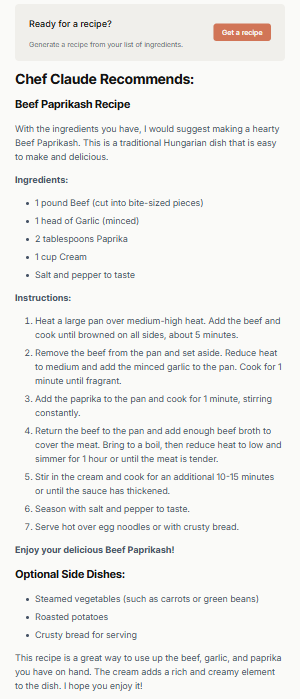

# 👨‍🍳 Chef Claude

Chef Claude is an AI-powered recipe suggestion app built with **React**, **Vite**, and the **Hugging Face Inference API**.  
It takes a list of ingredients you have and generates a delicious recipe — formatted beautifully in Markdown!

---

## 🚀 Features

- 🧠 AI-generated recipes using **Mistral (Mixtral-8x7B-Instruct)** via Hugging Face  
- ✨ Markdown-rendered output with **react-markdown**  
- ⚡ Built with **React + Vite** for fast performance  
- 🍅 User-friendly ingredient input and result display  
- 🔐 Secure use of API key through environment variables  

---

## 📸 Screenshots

### Home Page


### Adding Ingredients


### Recipe Ready


### Recipe


---

## 🛠️ Tech Stack

- **Frontend:** React, Vite, TailwindCSS  
- **AI Model:** Mistral 8x7B via Hugging Face Inference API  
- **Markdown Rendering:** `react-markdown` + `react-syntax-highlighter`  
- **Environment Handling:** Vite environment variables  

---

## ⚙️ Setup Instructions

1. **Clone the repository**
   ```bash
   git clone https://github.com/TasinTausif/Chef-Claude.git
   cd Chef-Claude
   
2. Install dependencies
   ```bash
   npm install

3. Set up environment variables
    Create a .env file in the project root and add:
    ```bash
      VITE_HF_ACCESS_TOKEN=your_huggingface_token_here

4. Run the app
    ```bash
    npm run dev

5. Open in browser
    Visit → http://localhost:5173
